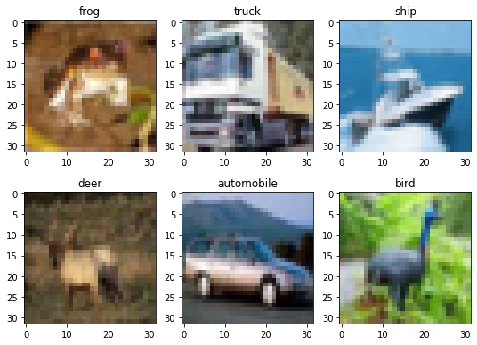

# Image classification on [CIFAR-10](https://www.cs.toronto.edu/~kriz/cifar.html)

Second Project for Deep Learning Methods course (summer semester 2019/2020) at Warsaw University of Technology.

Solution by Jakub Kała & Krzysztof Spaliński. 

## Content

TODO: comparision of different CNN architectures for solving [CIFAR-10](https://www.cs.toronto.edu/~kriz/cifar.html) dataset

 
